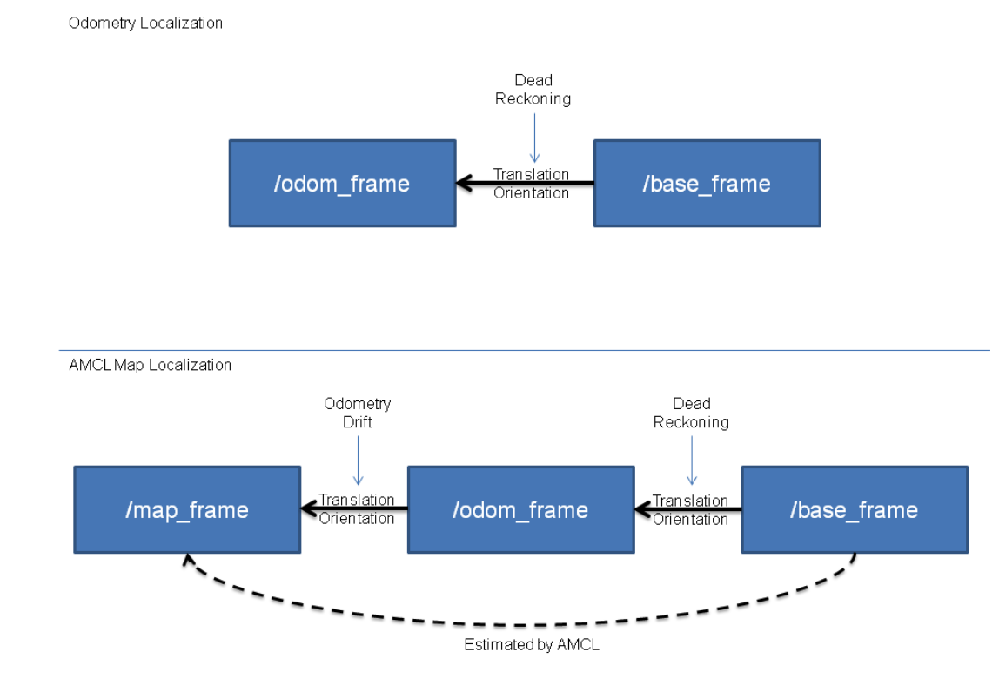

# 📝 基于 ROS 仿真的两轮差速移动机器人项目记录

记录了基于 ROS 仿真的两轮差速移动机器人项目的完成过程和一些注意点，同时在学习过程中对部分机器人的知识进行了补充。

**学习教程与参考资料**：[Autolabor ROS 教程](http://www.autolabor.com.cn/book/ROSTutorials/)

---

## 背景介绍

移动机器人是机器人学中的基础，为了进一步巩固移动机器人相关的基础知识以及进一步巩固对 ROS 软件的学习和了解，选取了移动机器人中的典型案例——两轮差速移动机器人，作为练手项目，旨在学习和巩固。

---

## 任务目标

1. 完成机器人在仿真环境的建模。
2. 实现机器人在仿真环境的自由移动。
3. 实现机器人在仿真环境中的自主 SLAM 和导航（SLAM（Simultaneous Localization and Mapping，同步定位与地图构建）和导航（Navigation））——重点明确 SLAM 的方法和导航的算法！

---

## 项目完成步骤

### 1. ROS 基础知识巩固

由于之前对 ROS 已经有了初步的学习，在了解了 ROS 的基础知识后，如：通信机制（Topic、Server、Param），即可开始实操。

---

### 2. 仿真机器人建模

在仿真环境中，描述仿真机器人的建模方法有很多，如：

- **URDF**：最常用的机器人建模文件格式和方法，适用于 Gazebo、Pybullet。
  - **xacro**：是 URDF 文件的拓展，可以简化 URDF 文件的编写，适合模块化设计。
- **SDF**：Gazebo 专用的描述文件格式，可以使用 `urdf2gazebo` 或 `xacro` 将 URDF 转换为 SDF。
- **MJCF**：适用于 MuJoCo 的配置文件，支持高度优化的刚体动力学仿真，适合强化学习和控制算法研究。
  - MJCF 更注重物理仿真性能，而 URDF 更注重机器人运动学描述。
  - 可以使用 `urdf2mjcf` 工具将 URDF 转换为 MJCF。
- **DAE 和 OBJ**：通常与 URDF 或 SDF 结合使用，用于加载机器人的 3D 模型，主要用于几何和外观描述，不包含运动学或动力学信息。
- **.ttm 和 .ttt 文件**：适用于 V-REP 和 CoppeliaSim。

#### URDF

由于 URDF 是最常见的机器人建模文件格式，因此选取 URDF 文件作为机器人建模文件的描述格式。同时不同的仿真环境有不同的机器人描述文件，但是基本的描述思路都是类似的。

URDF 文件主要有以下组件：

- **robot**：根标签，类似于 launch 文件中的 launch 标签。
- **link**：连杆标签。
  - 机器人实体的组成部分，可以定义为各种机器人部件，如轮子、底盘等。
  - 可以通过 `geometry` 属性编辑形状、`material` 属性编辑外观，`origin` 属性编辑相对位置等。
- **joint**：关节标签。
  - 机器人关节，发动机。
  - 关节连接在两个 link 之间，link 之间有 parent 和 child 关系。
  - 在 joint 关节中可以定义不同的关节类型，比如固定关节（fixed）、直线关节（prismatic）、旋转关节（continuous）。
  - 对 joint 关节的旋转方向和自由度都可以进行各种设置。
- **gazebo**：集成 Gazebo 需要使用的标签。
  - 用于在 Gazebo 中进行仿真显示。

#### 构建 URDF 机器人

URDF 文件具体细节可以查阅文件夹 `src/urdf`。


#### 用 xacro 配置仿真机器人

用 xacro 语言描述 URDF 文件，并添加关节控制器 `<plugin name="differential_drive_controller" filename="libgazebo_ros_diff_drive.so">`，使机器人的运动描述更方便。

xacro 文件细节可以查阅文件夹 `src/urdf/xacro`。

---

### 3. 仿真环境搭建

在 Gazebo 仿真器中搭建一个可以让两轮差速机器人进行自我探索的环境。Gazebo 中有许多内置物理模型和场景，可以自主插入并设计一个自己的环境，环境构建如下：


**补充**：为了让机器人能够进入 Gazebo 仿真环境中，需要在 URDF 文件或 xacro 文件中配置 `<gazebo>` 属性。

---

### 4. 基于键盘的机器人运动控制

在机器人的运动控制部分，采用了 Gazebo 中预定义好的 `libgazebo_ros_diff_drive.so` 文件来实现。由于 ROS 中常用 `/cmd_vel` 话题用来对机器人的运动状态进行控制，因此我们也通过 `/cmd_vel` 话题来作为中间件进行速度指令的通讯。

由于 `libgazebo_ros_diff_drive.so` 文件中已经做好了对两轮差速机器人的运动控制部分（也就是如何将各种运动状态 `/cmd_vel` 与差速机器人的两个关节 `left_wheel`、`right_wheel` 对应），因此我们想要控制机器人的运动，直接发布 `/cmd_vel` 的指令就可以，如：

```python
def publish_velocity(vel_x, vel_z):
    pub = rospy.Publisher('/cmd_vel', Twist, queue_size=1)
    vel_msg = Twist()
    vel_msg.linear.x = vel_x
    vel_msg.linear.y = 0
    vel_msg.linear.z = 0
    vel_msg.angular.x = 0
    vel_msg.angular.y = 0
    vel_msg.angular.z = vel_z
    pub.publish(vel_msg)
```

---

### 5. 机器人 SLAM 实现

#### SLAM 入门

SLAM（Simultaneous Localization and Mapping，同步定位与地图构建）是机器人领域中的一个核心技术，旨在让机器人在未知环境中同时完成以下两个任务：

1. **定位（Localization）**：确定机器人自身在环境中的位置和姿态。
2. **地图构建（Mapping）**：构建环境的地图（通常是 2D 或 3D 的）。

SLAM 是机器人自主导航的基础，广泛应用于自动驾驶、无人机、扫地机器人、仓储机器人等领域。

#### SLAM 的核心问题

1. **定位**：
   - 机器人需要根据传感器数据（如激光雷达、摄像头、IMU 等）估计自身的位置和姿态。
   - 定位问题可以看作是一个状态估计问题，通常使用滤波或优化方法解决。
2. **地图构建**：
   - 机器人需要根据传感器数据构建环境的地图。
   - 地图可以是 2D 的（如栅格地图）或 3D 的（如点云地图）。
3. **数据关联**：
   - 机器人需要将当前的传感器数据与已有的地图进行匹配，以更新定位和地图。
   - 数据关联是 SLAM 中最具挑战性的问题之一，尤其是在动态或相似环境中。

#### SLAM 的分类

1. **基于传感器的分类**：
   - **激光 SLAM**：使用激光雷达（LiDAR）作为主要传感器，适合构建 2D 或 3D 地图。
   - **视觉 SLAM（VSLAM）**：使用摄像头作为主要传感器，适合低成本、轻量化的应用。
   - **多传感器融合 SLAM**：结合多种传感器（如 LiDAR、摄像头、IMU 等），提高鲁棒性和精度。
2. **基于算法的分类**：
   - **滤波方法**：
     - 使用卡尔曼滤波（EKF-SLAM）或粒子滤波（FastSLAM）进行状态估计。
     - 适合实时性要求高的场景，但精度可能较低。
     - 滤波方法相关复习可以查阅：[Learning Note——滤波算法（信号处理）](https://vh8pq0y4c6.feishu.cn/docx/HwaeduJNCopgEwxwkUqcq2Linte)
   - **优化方法**：
     - 使用图优化（Graph-SLAM）或因子图优化（Factor Graph Optimization）进行状态估计。
     - 适合高精度场景，但计算复杂度较高。
3. **基于地图表示的分类**：
   - **栅格地图**：将环境划分为离散的网格，适合 2D 场景。
   - **点云地图**：使用点云表示环境，适合 3D 场景。
   - **拓扑地图**：将环境表示为节点和边，适合路径规划。

#### SLAM 的典型流程

1. **数据采集**：
   - 通过传感器（如 LiDAR、摄像头、IMU 等）采集环境数据。
2. **前端处理**：
   - 提取特征（如角点、边缘、平面等）。
   - 进行数据关联（如特征匹配、点云配准等）。
3. **后端优化**：
   - 使用滤波或优化方法估计机器人的位姿和地图。
   - 常用的优化方法包括图优化（Graph-SLAM）和因子图优化（Factor Graph Optimization）。
4. **地图更新**：
   - 根据优化后的位置和姿态更新地图。
   - 地图可以是 2D 栅格地图、3D 点云地图或拓扑地图。
5. **回环检测**：
   - 检测机器人是否回到了之前访问过的位置。
   - 回环检测可以显著提高 SLAM 的精度。

#### SLAM 的常用算法

1. **EKF-SLAM**：
   - 基于扩展卡尔曼滤波（EKF）的 SLAM 算法。
   - 适合小规模环境，但计算复杂度随地图规模增加而增加。
2. **FastSLAM**：
   - 基于粒子滤波的 SLAM 算法。
   - 适合大规模环境，但精度可能较低。
3. **Graph-SLAM**：
   - 基于图优化的 SLAM 算法。
   - 适合高精度场景，但计算复杂度较高。
4. **ORB-SLAM**：
   - 基于特征点的视觉 SLAM 算法。
   - 支持单目、双目和 RGB-D 摄像头。
5. **LIO-SLAM**：
   - 基于激光雷达和 IMU 的紧耦合 SLAM 算法。
   - 适合高动态环境。

#### SLAM 的挑战

1. **动态环境**：
   - 动态物体（如行人、车辆）会影响数据关联和地图构建。
2. **计算复杂度**：
   - 大规模环境下的 SLAM 计算复杂度较高。
3. **传感器噪声**：
   - 传感器噪声会影响定位和地图构建的精度。
4. **回环检测**：
   - 在相似环境中，回环检测可能失败。

---

### 6. 项目应用

在本次项目的两轮差速机器人上，安装了一个 2D 线性激光雷达作为 SLAM 的传感器，由此我们需要先了解 2D 线性激光雷达的原理与数据格式。

#### 2D 线性激光雷达

2D 线性激光雷达（如 RPLIDAR、Hokuyo 等）是一种常用的传感器，用于获取环境的距离信息。它通过发射激光束并测量反射时间来计算物体与雷达之间的距离，从而生成环境的 2D 扫描数据。

- **公式**：距离 = (光速 × 时间) / 2。
- 每次扫描会生成一组距离数据，称为一帧扫描（Scan）。

在 ROS 中，激光雷达的数据以 `sensor_msgs/LaserScan` 消息类型发布，可以把激光雷达发送出来的数据类似成一个以时间、角度、距离为纬度的三维数组。

得到了激光雷达的数据还无法完成建图，因为激光雷达的数据是相对机器人本体的，我们需要知道机器人本体相对环境的相对位置和姿态。

#### 里程计

为了记录机器人相对环境的位置变换，通常使用加速度计或者电机编码器来记录机器人的运动状态改变，并通过积分操作实现对机器人运动里程的记录。

在本项目中，使用了电机编码器来实现里程计的功能，电机编码器与里程计的具体配置在文件 `libgazebo_ros_diff_drive.so` 中完成配置，所以此处不展开。

在 ROS 仿真环境中，控制器只需要订阅 `odom` 话题即可实现对机器人本体位置的检测。

**里程计定位**：通过里程计数据实现 `/odom_frame` 与 `/base_frame` 之间的坐标变换。

此处提到的坐标变换，还需要提到 `tf` 包，也就是 `transform package`。

#### TF（Transform）

用于实现坐标变换和传感器数据融合，核心功能就是用变换矩阵来将相对位置和绝对位置进行方便的转换。

其实本质和机器人正逆运动学一致。每个 link 都有一个自己的坐标系 Frame，同时每个 link 之间都有一个坐标系的变换矩阵 transform，一般来说变换矩阵通常用一个 4x4 的齐次变换矩阵表示，包含平移（translation）和旋转（rotation）部分。

变换矩阵的通用形式如下：

$$
\left[\begin{array}{cccc}
R_{11} & R_{12} & R_{13} & T_{x} \\
R_{21} & R_{22} & R_{23} & T_{y} \\
R_{31} & R_{32} & R_{33} & T_{z} \\
0 & 0 & 0 & 1
\end{array}\right]
$$

其中，$R_{ij}$ 组成一个 3x3 的旋转矩阵，表示坐标系之间的旋转关系；$T_x, T_y, T_z$ 表示沿 $x、y、z$ 轴的平移量。

---

### 7. 使用 gmapping 进行建图

由上述，选择了调用 `gmapping` 功能包，`gmapping` 功能包已经订阅了雷达数据 `scan` 和坐标变换 `tf` 的话题。

SLAM 的具体流程如下：

1. **构建雷达坐标系到里程计坐标系的转换矩阵 tf**：
   1. 雷达坐标系 `scan` → 基坐标系 `base_link` → 里程计坐标系 `odom`。
   2. 雷达坐标系 `scan` → 基坐标系 `base_link`：
      - 一般由 `robot_state_publisher` 或 `static_transform_publisher` 发布。
   3. 基坐标系 `base_link` → 里程计坐标系 `odom`：
      - 一般由里程计节点发布。
2. **gmapping 中实现将雷达数据 `scan` 整合到里程计 `odom` 坐标系中，并使用粒子滤波算法估计机器人的位置和姿态**。
3. **gmapping 发布里程计坐标系 → 地图坐标系的转换 `tf` 和地图栅格数据 `map`，实现地图的构建**。

---

### 8. 使用 Amcl 实现机器人定位

AMCL（Adaptive Monte Carlo Localization）是用于 2D 移动机器人的概率定位系统，它实现了自适应（或 KLD 采样）蒙特卡洛定位方法，可以根据已有地图使用粒子滤波器推算机器人位置。

核心话题是：`particlecloud`（`geometry_msgs/PoseArray`），通过地图上粒子的概率分布可以推导出机器人位置。

区别于 `gmapping` 中使用里程计 `odom` 定位的方法，添加 `amcl` 的方法可以更加精准的完成在已知地图上的机器人定位任务。



相当于多了一层位置的校验，可以定位更加准确。

---

### 9. 机器人导航实现

在知道了机器人的自身位置和地图之后，就可以实现机器人的导航了。输入地图上的目标位置，根据当下机器人位置，和地图上障碍物的分布，就可以根据路径规划算法找到一条路径。为了避免机器人在移动的过程中与障碍物发生碰撞，我们还需要考虑机器人自身尺寸、规划出的路径、障碍物三者之间的位置关系，这就涉及到了一个局部路径规划算法（Local Planner）。

- **全局规划器（Global Planner）**：负责从地图服务器获取全局地图数据，并根据输入的导航目标生成全局路径。
- **局部规划器（Local Planner）**：负责根据全局路径和实时传感器数据，生成局部路径，以避开动态障碍物。

本项目中使用了 ROS 自带的 `move_base` 功能包，它自带了全局路径规划（默认使用 `navfn`，包含了 Dijkstra 算法和 A* 算法）和局部路径规划（滑动窗口 DWA 算法），由此只需要配置一下地图和机器人的相关参数即可实现路径规划。

有关机器人平面路径规划的相关笔记参考：[Learning Note——Path Planning](https://vh8pq0y4c6.feishu.cn/docx/Fo1VdSDwdoZPWYxGGo2cxPPBnNf)

---

## 项目完成过程中学习到的知识汇总

- **ROS**
- **机器人仿真**
- **机器人 SLAM 基础**
- **机器人导航基础**

--- 
